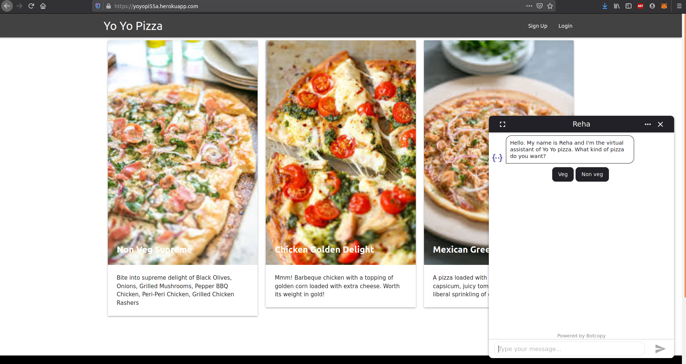

# pizza-ordering-bot  
A simple pizza ordering chatbot

Steps to use the bot 
1. Select your type of pizza. (veg or non-veg)
2. Choose a pizza from the given options
3. Enter size of the pizza
4. Add toppings if you need any
5. Add count of pizzas
6. Enter your name, phone number and address (please enter a valid 10 digit phone number and address)
7. You can also ask the status of your pizza

## UI of the app

## Architecture of the project

